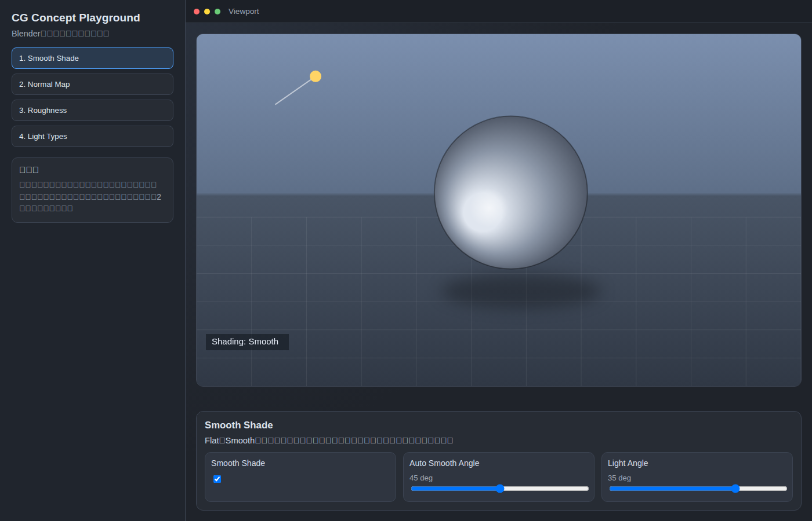
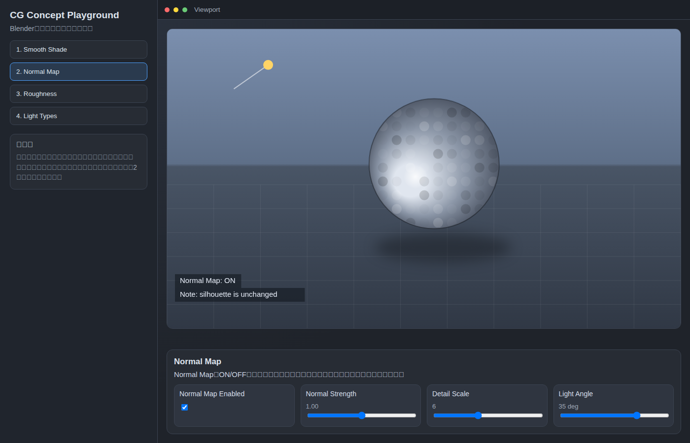
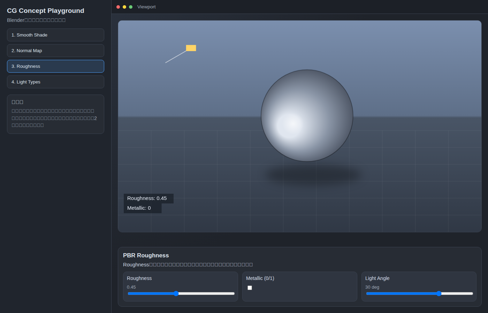
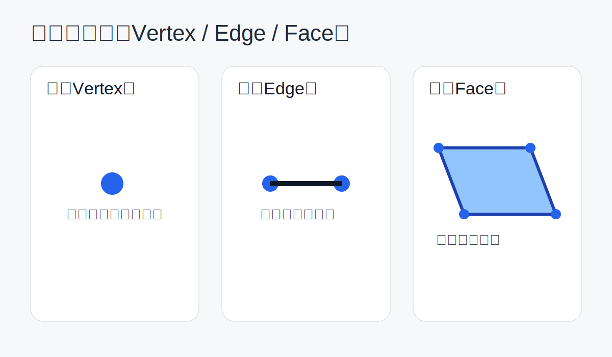
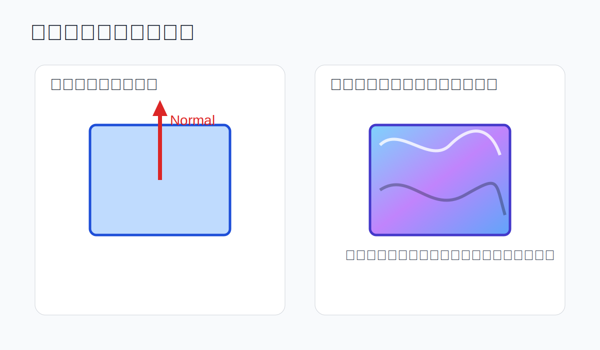
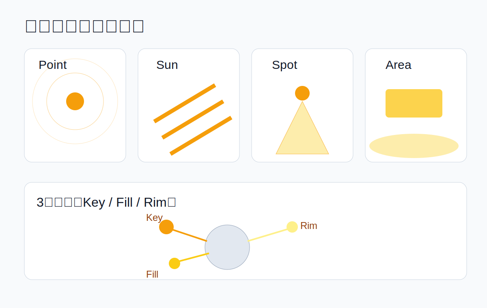
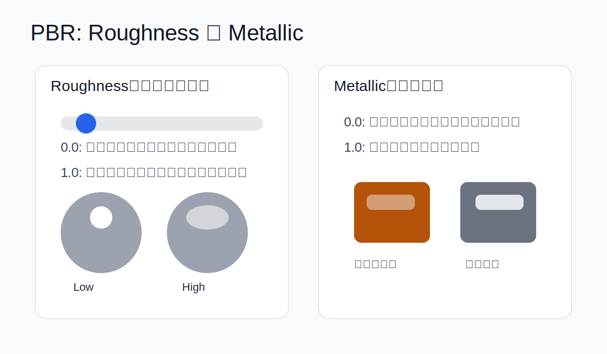

# Blender実習を支えるCG基礎リーディング

この資料は、Blenderの操作手順書ではなく、**操作の意味をCGの基礎概念で理解するための読み物**です。  
授業ではBlender実習を主軸とし、本資料は「なぜそう見えるか」を補う副読本として使います。

- 対象：CG初心者 / Blender初心者
- 想定読了：45〜60分
- 目的：モデリング・マテリアル・ライティングを同じ文脈で理解する

---

## 0. 体感デモ（GitHub Pages / HTML）

読み物は本資料、触って確認する部分はデモページで行います。  
各デモは「何を変えたか」「どこが変わったか」の2点だけ見れば十分です。

- デモページ本体: [CG Concept Playground](./interactive/index.html)
- Smooth Shade: [開く](./interactive/index.html#smooth)
- Normal Map: [開く](./interactive/index.html#normal)
- Roughness: [開く](./interactive/index.html#roughness)
- Light Types: [開く](./interactive/index.html#light)

---

## 1. 形の最小単位：頂点・辺・面

3DCGモデルは、基本的に次の3つでできています。

- 頂点（Vertex）：空間上の点
- 辺（Edge）：頂点同士をつなぐ線
- 面（Face）：辺で囲まれた領域

Blenderの編集モードで行う多くの操作は、この3要素の再配置です。  
つまり「モデリング」は、粘土をこねるというより、**点と線と面の構造を設計する作業**です。

### なぜ面の流れ（トポロジ）が大事か

同じ見た目でも、面の流れが違うと次が変わります。

- 変形のしやすさ（アニメーション時に崩れにくいか）
- 陰影の安定性（シェーディングの破綻が出ないか）
- 編集のしやすさ（ループカットが通るか）

初心者段階では、まず「大きい形を壊さない面の流れ」を優先すると理解が進みます。

---

## 2. 見た目の滑らかさ：Smooth Shadeと法線

モデルの見た目は「形状」だけでなく、**法線（Normal）**に強く依存します。

法線は、面がどちらを向いているかを示す向きベクトルです。  
レンダラはこの向き情報を使って光の当たり方を計算します。

### Smooth Shadeは何をしているか

Smooth Shadeは、面の境目ごとに法線を補間して、連続的に見せる機能です。

- ポリゴン数はほぼそのまま
- でも陰影は滑らかに見える

ここが重要です。  
**Smooth Shadeは形を増やしていない**ため、シルエットは変わりません。

### Auto Smooth / シャープエッジ

全部を滑らかにすると、機械的な硬い角まで丸く見えます。  
そのため、法線を分ける（シャープを立てる）ことで、

- 滑らかにしたい部分は滑らか
- 角として見せたい部分は角

という制御をします。

---

## 3. ノーマルマップ：形を増やさず情報を増やす

ノーマルマップは、テクスチャに法線方向の変化を記録し、細かな凹凸があるように見せる手法です。

### 何が起きているか

- 実際のメッシュ形状：ほぼそのまま
- シェーディング用の法線：ピクセル単位で変化
- 結果：彫刻的ディテールがあるように見える

### 強みと限界

強み：

- 軽量化しやすい（高密度メッシュをそのまま使わない）
- 表面情報を豊かにできる

限界：

- 輪郭（シルエット）は変えられない
- 強い凹凸を横から見たときの説得力は実ジオメトリに劣る

要するにノーマルマップは、**形状そのものではなく光の応答を編集する技術**です。

---

## 4. ライティング：モデルの良し悪しを見える化する

同じモデルでも、ライトで印象は大きく変わります。  
ライティングは「照らす作業」ではなく、**情報を読ませる設計**です。

### Blenderでよく使うライト

- Point：点光源。電球のように全方向へ
- Sun：平行光。屋外光の基準を作りやすい
- Spot：方向性が強い。視線誘導に向く
- Area：面光源。柔らかい反射や影を作りやすい

### まず見るべき3要素

ライトを見るときは、次の3つを分けて考えると整理できます。

- 方向：どこから当たるか
- 強度：どれだけ明るいか
- サイズ：影とハイライトがどれだけ硬い/柔らかいか

---

## 5. 有名なライト配置（基礎）

授業でまず押さえるなら、この2つが実用的です。

### 3点照明（Three-Point Lighting）

- Key Light：主光源。形の主情報を作る
- Fill Light：影を持ち上げる補助
- Rim (Back) Light：輪郭を背景から分離

用途：人物、プロダクト、作品提出用の見せカット

### Rembrandt寄りの配置（片側キー＋反対側弱フィル）

顔や物体の片側にしっかり陰影を作り、反対側はわずかに起こす構成です。

- 立体感が出やすい
- 雰囲気を作りやすい
- 初心者でも「意図ある明暗」を作りやすい

最初は「ライトを増やす」より、**役割を分ける**のが上達の近道です。

---

## 6. PBRマテリアルを軽く理解する

PBR（Physically Based Rendering）は、光と材質の関係を物理ベースで扱う考え方です。  
BlenderのPrincipled BSDFは、PBRの主要パラメータをまとめています。

### Base Color

物体の基本色。  
ただし「見える色」はライトや反射環境と常にセットで決まります。

### Roughness（つるつる / ざらざら）

- 低い：反射が鋭い（つるつる）
- 高い：反射が広がる（ざらざら）

「テカる/安っぽい」問題の多くは、まずRoughness調整で改善できます。

### Metallic

- 0：非金属（木、布、皮膚、樹脂）
- 1：金属（鉄、アルミ、銅）

入門では0か1を明確に使い分けると破綻しにくくなります。

### 重要な前提

PBRは魔法ではありません。  
**正しいライト環境**があって初めて材質差が見えます。  
つまり「マテリアル設定」と「ライティング」はセットです。

---

## 7. Blender実習に接続する見方

ここまでの概念を、実習時には次の問いで使います。

- 今触っているのは「形状」か「法線」か「材質」か「光」か？
- この変更で、ハイライトと影はどう変わるはずか？
- 変わらないはずのもの（例：ノーマルマップでシルエット）は何か？

この問いを持てると、操作暗記ではなく原因と結果で考えられるようになります。

---

## 8. 最低限のまとめ

- モデリングの土台は頂点・辺・面
- Smooth Shadeは法線補間で、形状追加ではない
- ノーマルマップは陰影を増やす技術で、輪郭は変えない
- ライティングは情報設計。まず3点照明を理解する
- PBRはRoughnessとMetallicの意味を押さえるだけでも効果が大きい

この5点を軸にすると、Blender実習の「なぜ」が一気につながります。
